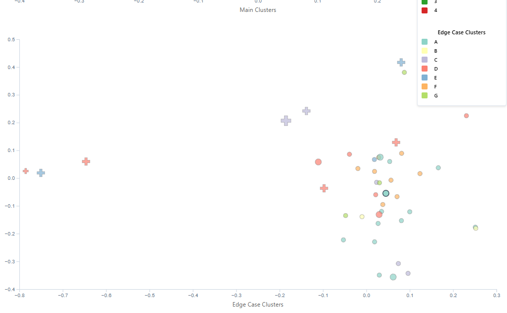

# Co-DETECT
Co-DETECT: **Co**llaborative **D**iscovery of **E**dge cases in **TE**xt **C**lassifica**T**ion

### Environment Requirements

- Node.js: v22.11.0
- Python: 3.11.10

### Choose Your Testing Mode

**🚀 Demo Mode (Fastest - 2 minutes)**
- No backend setup required
- Pre-loaded demonstration data
- Perfect for quick system overview

**⚙️ Backend Mode (Complete - 5 minutes)**  
- Full backend functionality (requires valid API keys)
- Test actual data processing pipeline
- Recommended for thorough evaluation

---
## How to Use

### Optional: Create a New Conda Environment

For ease of use, you could create and activate a new conda environment using:

```bash
conda create -n co_detect python=3.11.10
conda activate co_detect
```

### 0. API Key Configuration

To use live API calls in Backend Mode, create `.env` file in `/annotation_fastapi/`:
```bash
OPENAI_API_KEY=your_openai_api_key_here
DEEPSEEK_API_KEY=your_deepseek_api_key_here
```
**Note**: Backend Mode always makes real OpenAI and DeepSeek API calls, so ensure your API keys are set.

### 1. Launch Backend (Only for Backend Mode)
```bash
cd annotation_fastapi
pip install -r requirements.txt
uvicorn main:app
```

Please note: once you run `uvicorn main:app`, it will show a message saying `Uvicorn runing on http://127.0.0.1:8000 (Press CTRL+C to quit)`, but there is no need to click on the local host in your terminal, please just go ahead and follow the step 2 below.

### 2. Run Analysis Using Our Frontend
After launching the backend locally, you can run the analysis using our [**Deployed Frontend**](https://autodetect.vercel.app/)

### 2a. (Alternative) Launch Frontend on Your Own

#### a. Install nvm
If you haven't installed nvm yet, run:
```bash
curl -o- https://raw.githubusercontent.com/nvm-sh/nvm/v0.39.7/install.sh | bash
```
Then restart your terminal or run:
```bash
source ~/.nvm/nvm.sh
```

#### b. Install and Start Frontend
```bash
cd frontend
nvm install      # Reads version from .nvmrc (v22.11.0)
nvm use          # Switches to the project's Node.js version
npm install
npm run dev
```
Open [**Local Host**](http://localhost:5173)

### 3. Interface Overview

#### Home Page - Setup Your Annotation Task
1. **Task Description**: Describe your annotation task
2. **Labels**: Add the categories you want to classify (minimum 2 labels)
3. **Text Input**: Paste text directly or upload CSV file
4. **Submit**: Click "Submit" to start analysis (or "Load Demo Data" for quick demo)

#### Dashboard Page - Analyze Results
- **Left Panel**: 
  - **Previous Guidelines**: Review earlier guideline versions
  
  - **Current Guidelines**: Edit task description and labels
  
  - **Edge Case Handling**: Saved improvement rules
  
- **Center Panel**: **Dual Scatter Plots**
  - **Upper plot**: All annotated examples ↔ **Right: All Examples**
  
  - **Lower plot**: Edge cases needing attention ↔ **Right: Suggested Edge Cases**
  
- **Right Panel**:
  - **All Examples**: Click points or examples to see details
  
  - **Suggested Edge Cases**: Click + to save edge case handling suggestions, then iterate (iterate buttom at top right corner)
  
  
  - **Annotate New Examples**: Click `Annotate New` to annotate additional samples with current guideline on the left panel. Reannotating existing samples with 🔁
  
  

### 4. Two Testing Modes

#### Mode 1: Demo Mode (Recommended)
**🚀 No setup required - instant demo**
1. Click **"Load Demo Data"** on home page
2. Explore the dashboard immediately
3. Test iteration with pre-loaded demo data

#### Mode 2: Backend Mode (Complete Experience)
**⚙️ Full backend pipeline**

**Option A**: Upload CSV file `/annotation_fastapi/example/ghc_rnd.csv`
**Option B**: Click "Load Sample Examples" then submit

### 5. Key Features to Test

#### Interactive Analysis
- **Upper Plot ↔ All Examples**: Click points in upper plot or examples in right panel - they highlight each other
- **Lower Plot ↔ Suggested Edge Cases**: Click points in lower plot or suggestions in right panel - they interact
- **Cross-Plot Connection**: Clicking lower plot points also highlights corresponding upper plot points

#### Improvement Workflow
1. **Save Suggestions**: Click + button next to useful suggestions in "Suggested Edge Cases"
2. **View Saved Rules**: Check "Edge Case Handling" panel for your saved rules  
3. **Iterate**: Click "Iterate" button to re-annotate using improved guidelines
4. **Compare Results**: View before/after annotation changes


